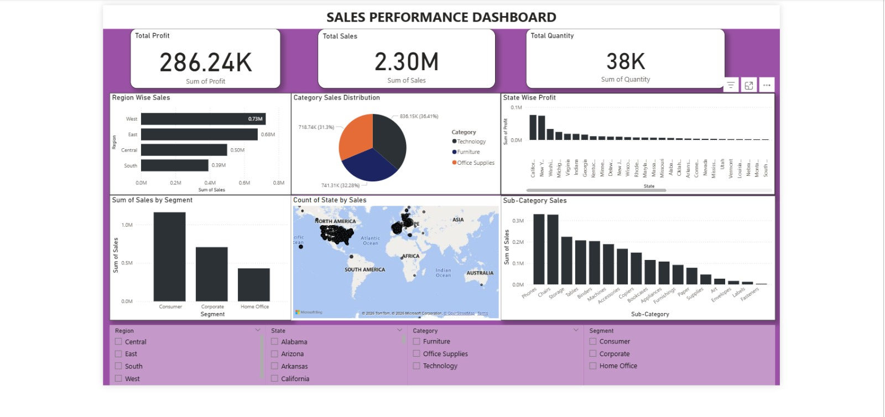

# 📊 Sales Performance Dashboard | Power BI

## 📌 Project Overview

This project presents an interactive **Sales Performance Dashboard** built using **Power BI**. The dashboard provides valuable business insights by analyzing sales, profit, quantity, customer segments, product categories, and regional performance.

The objective of this project is to transform raw sales data into meaningful visualizations that help stakeholders make data-driven decisions.

---

## 🚀 Features

* Interactive dashboard with slicers and filters
* Sales, Profit, and Quantity KPI tracking
* Regional sales performance analysis
* Category-wise and Sub-category-wise sales analysis
* Customer Segment analysis
* State-wise profit comparison
* Geographical sales visualization using maps
* Business insights for decision-making

---

## 🛠️ Tools & Technologies

* Power BI
* Microsoft Excel
* Data Visualization
* Business Intelligence (BI)
* Data Analytics

---

## 📈 Key Performance Indicators (KPIs)

| Metric         | Value   |
| -------------- | ------- |
| Total Profit   | 286.24K |
| Total Sales    | 2.30M   |
| Total Quantity | 38K     |

---

## 📊 Dashboard Insights

### 1. Regional Performance

* West Region generated the highest sales.
* Sales performance varied significantly across regions.

### 2. Category Analysis

* Technology category contributed the highest revenue.
* Furniture and Office Supplies also played important roles in overall sales.

### 3. Customer Segment Analysis

* Consumer Segment recorded the highest sales.
* Corporate and Home Office segments contributed moderately.

### 4. State-wise Profit Analysis

* Profit distribution varied across states.
* Certain states showed significantly higher profitability.

### 5. Product Analysis

* Sub-category sales revealed top-performing product groups.
* Business can focus on high-performing products for growth.

---

## 🎯 Business Impact

This dashboard helps businesses:

* Monitor overall sales performance
* Identify top-performing regions and categories
* Understand customer purchasing behavior
* Improve strategic decision-making
* Track business growth using KPIs

---

## 📷 Dashboard Preview

dashboard screenshot here:

---

## 📚 Skills Demonstrated

* Data Cleaning
* Data Transformation
* Dashboard Design
* KPI Reporting
* Data Storytelling
* Business Intelligence
* Data Visualization
* Analytical Thinking

---

## 🔮 Future Enhancements

* Forecasting and Trend Analysis
* Customer Retention Metrics
* Profit Margin Analysis
* Time-Series Sales Analysis
* Advanced DAX Measures

---

## 👩‍💻 Author

**Semon Aftab**

Aspiring Data Analyst | Power BI Enthusiast | Python Learner

Currently building projects in Data Analytics, Power BI, SQL, Excel, and Python to strengthen analytical and business intelligence skills.

---

### ⭐ If you found this project useful, consider giving it a star!
